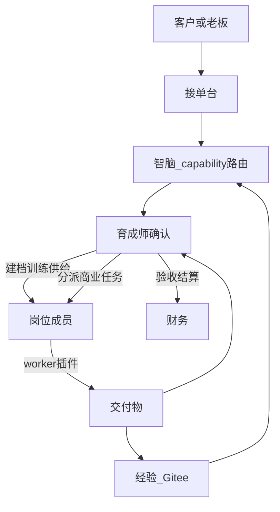

# Evo 主线状态（个人公司 · 商业智脑）

## 1. 产品定义

Evo 是**个人公司的商业智脑操作系统**：

- **你**：公司管理者，下达经营目标并决定接什么活。
- **育成师**（`talent_development_officer`，≈CTO）：对内孵化岗位成员；对外对接接单、确认智脑路由、协调与验收。
- **财务**（`finance`）：营收/成本/结算，回答「值不值得继续做」。
- **岗位成员**（`child_members`）：由用户创建；按工种交付。
- **接单台（消费前端）**：外包/经营任务入口 → 智脑按 capability 推荐 → 育成确认分派 → 交付 → 结算。

**两条环**：

| 环 | 目的 | 状态 |
|----|------|------|
| **供给环** | 建档、补知识、训练、复盘、技能/经验 → Gitee | 已偏厚 |
| **消费环** | 接单 → 分派 → 交付 → **结算** | **主缺口已补最小闭环** |

**不是产品主线**：JS 逆向 / reconstruct、Android / PC 分析、MCP 协议接入（默认关闭）。

---

## 2. 主流程（目标态）



---

## 3. 角色与代码映射

| 产品角色 | 后端 / 前端标识 | 完成度（粗估） |
|----------|-----------------|----------------|
| 接单 / 消费环 | `intake_*`；`/organization/intake` | **~75%** |
| 育成师 | `talent_development_officer`；`/api/autonomy/*` | **~75%** |
| 财务 | `finance_runtime` + 接单 settle | **~85%** |
| 岗位成员 | `POST /api/autonomy/employees` | **~70%** |
| 自主学习（模型） | `model_provider` + 补知识写回 journal | **~90%** |
| 测试工种（可插拔） | `openSpec/workers/self_media_operations`，默认关闭 | **~75%** |
| 平台底座 | Admin、队列、租户、Git 导出 | **~75%** |

**按产品定义的整体完成度：约 92%–94%（DeepSeek 实网补知识写回已验；双环飞轮齐；真实渠道履约/公网加固仍非 100%）。**

---

## 4. 已落地（与产品相关）

### 消费环（接单）

- `intake_center` 状态机：`received → analyzing → assigned → in_progress → delivered → settled`
- 路由策略：`.admin/intake_routing_policies.json`（capability 别名 + resolve_by，**无平台名硬编码**）
- API：`/api/autonomy/intake*`；UI：`/organization/intake`
- 分派创建正式任务并可选入队 `operation_*`（由 worker manifest 驱动）
- 结算调用 `upsert_finance_period(channel=commercial)`
- 看板 / 育成入口 / 商业化就绪步骤含接单
- M1 探测：`run_intake_commercial_probe`（`EVO_M1_SKIP_INTAKE=1` 可跳过）

### 育成师 / 供给环

- 正式任务、Memory Hub、补知识、复盘、经验卡、work-node 归档
- 跨工种协作（配置驱动）

### 财务

- 动态 `project_id`；接单结算与 analytics 均可落盘
- `GET /api/finance/overview`

### 工种（测试 · 自媒体插件）

- 仅作首条交付插件；intake 核心不出现平台品牌字符串
- W 段：`scripts/m1_ops_check.py --with-worker-smoke`

### 架构约束

- 见 [INTAKE_ARCHITECTURE_CN.md](INTAKE_ARCHITECTURE_CN.md)、[COLLABORATION_ARCHITECTURE_CN.md](COLLABORATION_ARCHITECTURE_CN.md)
- **禁止**在 intake/路由核心写死工种名或员工 id

---

## 5. 未落地 / 短板

| 短板 | 影响 |
|------|------|
| 渠道浏览器 | 已支持可选 Playwright（`EVO_CHANNEL_BROWSER=playwright`）；未装/失败回退 stub |
| 智脑路由为规则+能力重叠打分 | 更深 LLM 理解后置（学习侧模型已通） |
| ~~经验反哺路由~~ | 已落地：`journal_routing_score_bonus` + feedback 文件双通道 |
| 无 pytest 回归套件 | 改 intake/财务易回归 |
| 生产 Session / HTTPS | 对外 SLA 未就绪（本地桌面可先运营） |

---

## 6. 验证记录

```bash
PYTHONPATH=src python3 scripts/m1_ops_check.py
# P0：干净环境 + 工种链路 + 进化探测 + 接单消费环探测

EVO_M1_SKIP_EVOLUTION=1 EVO_M1_SKIP_INTAKE=1 PYTHONPATH=src python3 scripts/m1_ops_check.py
# 快速跳过长探测

# DeepSeek 已配置时：真实模型补知识写回（非 mock）
EVO_M1_LIVE_MODEL=1 PYTHONPATH=src python3 scripts/live_deepseek_knowledge_probe.py
```

---

## 7. 下一步优先级

1. ~~经验/覆盖原因写回路由反馈~~（已落地：`intake_routing_feedback.json` + analyze 加权）  
2. ~~结算后自动经验导出~~（本地 `.admin/local_git_exports/`；远端仓就绪可再同步）  
3. ~~插件履约产物回挂工作台~~（`finalize_operation_result` → intake/formal task `fulfillment.artifacts`）  
4. ~~接单通演示闭环（自动化）~~（M1：`P0 接单通演示财务可见` + 消费环全路径探测）  
5. ~~第二工种仅加配置可路由~~（M1：`P0 第二工种仅配置可路由`，intake 核心零改）  
6. ~~自主学习模型配置 + 补知识写回经验卡~~（公司设置 `model_provider`；M1：`P0 模型补知识写回经验`）  
7. ~~经验卡反哺路由 + 补知识计入独立就绪~~（`journal_bonus`；任务+补知识可替代第二轮正式任务）  
8. ~~可选 Playwright 渠道浏览器~~（executor 层；见 `executors/toutiao/README_PLAYWRIGHT.md`）  
9. ~~DeepSeek 连接 UI + Playwright 配置 + 实网补知识~~（`scripts/playwright_verify_deepseek.py` / `scripts/live_deepseek_knowledge_probe.py`）  
10. ~~员工工作台经验卡 UI 验收~~（`scripts/playwright_verify_experience_cards.py`；修复 growth tab 深链）  
11. 生产加固（自动化侧：`production_readiness_check.py`；当前阻塞：人工设置强 `SESSION_SECRET` + HTTPS）  

---

## 8. 登录与运维备注

- 统一使用 `localhost` 或 `127.0.0.1` 之一，避免 cookie 域不一致  
- 生产须更换 `SESSION_SECRET`、配置 HTTPS  
- 详见 [ADMIN_README.md](../ADMIN_README.md)、[START.md](../START.md)
