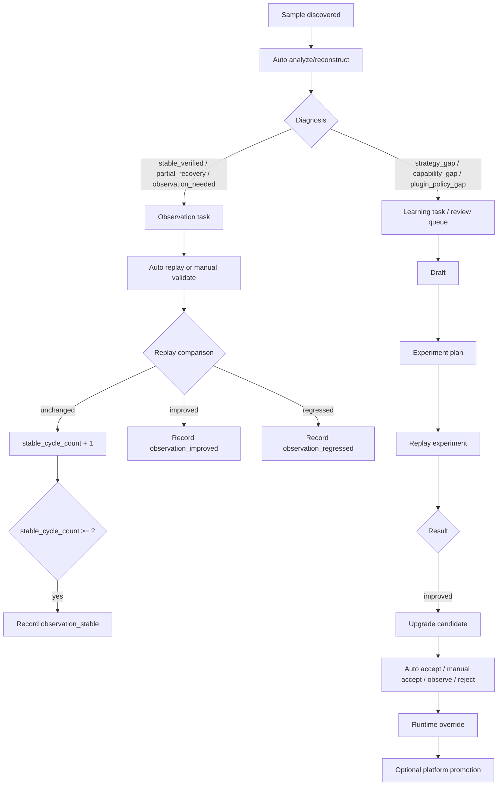

# Evo Mainline: Autonomous Growth Loop

## Current Mainline

`evo` 当前主线不是单次流水线，而是围绕 `mcp` 的持续自治闭环：

1. 发现样本
2. 自动提交 `analyze / reconstruct`
3. 自动诊断当前结果是否稳定、是否缺能力、是否缺策略
4. 稳定样本进入观察任务
5. review / failed 样本进入复盘、实验、升级候选
6. 连续稳定或明显增益后沉淀为成长事件
7. 可按租户策略决定保留私有、共享到平台层，或后续同步到 Gitee / GitLab

## Runtime Flow

## Real JS Reverse Path

以工作区（如 `evo_workbench` 或 `EVO_ADMIN_WORKSPACE`）当前案例为例，已经跑通：

- JS 样本被识别并自动进入 `reconstruct`
- 策略命中 `builtin.javascript.reconstruct.scaffold`
- 稳定样本进入 `baseline_tracking`
- 重放比较连续两轮 `unchanged`
- 触发 `observation_stable`

这说明当前系统已经从“只会跑任务”进入“会把稳定性本身当成成长证据”。

## Why This Matters

这套闭环的意义是：

- 不再要求每次都靠人手动判断“这次值不值得沉淀”
- 系统会自己判断当前样本属于继续观察、继续实验、还是进入升级
- 手动验证不再是脱离系统的临时动作，而是观察任务的一部分
- 后续扩展 Android、PC、PDF、爬虫、自动化时，复用的是同一个自治骨架

## Domain Direction

后续 `src/domains` 不应再理解成写死的业务分类，更适合拆成：

- `capabilities`
  当前能做什么，如 `javascript.reverse`、`android.unpack`、`pdf.extract`
- `research modules`
  当前如何研究，如 `observation_loop`、`review_loop`、`experiment_loop`
- `knowledge adapters`
  当前知识存哪里，如 local、platform-shared、gitee、gitlab、enterprise-private

这样后续新增爬虫、自动化、企业私有领域时，不需要大改主干，只是新增模块和注册。

## Storage Model

建议采用三层知识结构：

1. 租户私有层
   每个用户/企业自己的经验、技能、日志、样本、策略
2. 平台共享层
   经过验证并允许共享的通用经验
3. 外部存储层
   Gitee / GitLab / 企业自建仓库，负责容量与版本沉淀

可把你的设想理解为：

- Evo 服务器是“大脑”
- Git 仓库是“长期记忆容器”
- Admin API + 决策引擎是「大脑调用各类能力和知识容器的统一接口」

## Next Priorities

当前建议按这个顺序继续推进：

1. 先把 JS reverse 主线做深
   目标：不仅能识别框架和组件名，还能持续研究并沉淀“可复用处理经验”
2. 把知识存储适配层抽象出来
   目标：本地、Gitee、GitLab、企业私有都走统一接口
3. 把自治研究源扩展到更多输入
   目标：PDF、网页、APK、PC 程序都能进入同一观察/实验/成长闭环
4. 做真正的“发现问题并解决问题”
   目标：当无法处理时，系统能自动给出下一步研究方向、工具缺口、验证计划

## One Sentence Summary

当前 Evo 主线已经从“自动执行 JS reconstruct”推进到“会对 JS reverse 结果做持续观察、自动重放、比较稳定性并把稳定结果沉淀为成长事件”的阶段。
